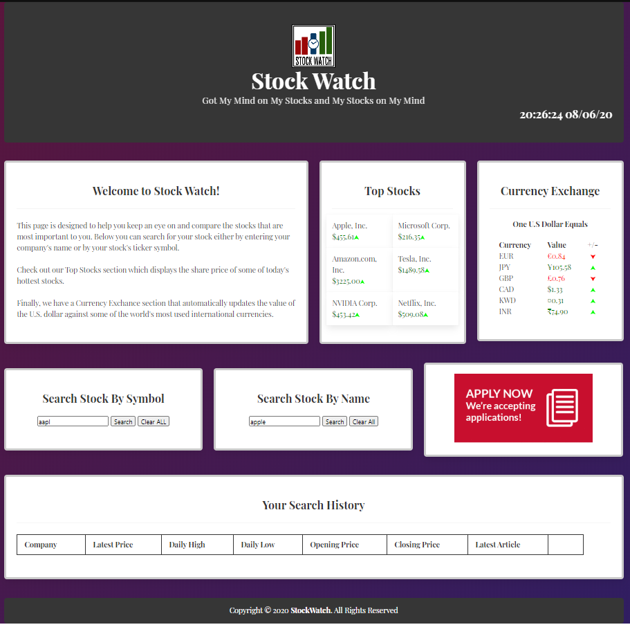

# Project 1 : Stock Watch

# User Story

We wanted to create a Web Application where beginning investors can search and compare stock prices in a clear and concise environment. We wanted to enhance the user experience by adding sections for top stocks and a currency exchange table.

We made use of 3 APIs to allow the user to search for real time stock prices and provide us with the currency exchange values. 

As a BEGINNER INVESTOR\
I WANT to be able to search for general information on stocks\
SO THAT I can keep track of the stocks I choose\
WHEN I search a stock\
THEN it is displayed so I can plainly view it and compare it with others

# Technologies We Used
* HTML5
* CSS3
    * [Bulma](https://bulma.io/documentation/)
    * [Animate.CSS](https://animate.style/)

* JavaScript
    * [Moment.js](https://momentjs.com/)
    * JSON

* jQuery

# List of APIs We Used
* [OpenExchangeRates](https://openexchangerates.org/)
* [IEX Cloud](https://iexcloud.io/docs/api/)
* [Financial Modeling Prep](https://financialmodelingprep.com/developer/docs/)

# References
* [Markup Validation Service](https://validator.w3.org/) - to validate HTML pages.
* [FreeLogoDesign](https://www.freelogodesign.org/) - for Logo Design.
* [CSS Gradient Background](https://codepen.io/P1N2O/pen/pyBNzX) - for gradient background.

# Contributors
* [Ed Gibbons](https://github.com/egibbs834)
* [Georgios Mpovolis](https://github.com/gmpovolis)
* [Jonghyun Kang](https://github.com/misterjaykay)
* [Maurya Patel](https://github.com/maurya512)

# Links
* [Project Repository](https://github.com/misterjaykay/Project-1)
* [Project Page](https://misterjaykay.github.io/Project-1/)

# Content Preview

# Powerpoint Presentation
https://drive.google.com/file/d/1EhFNla_0NU8vooDPXNW5gW2Je_1a1uvL/view?usp=sharing
